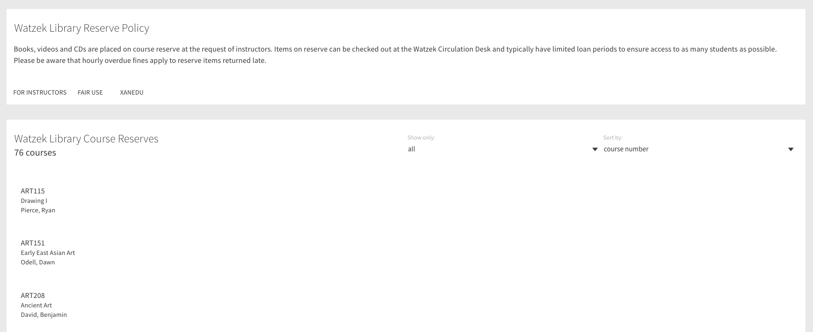
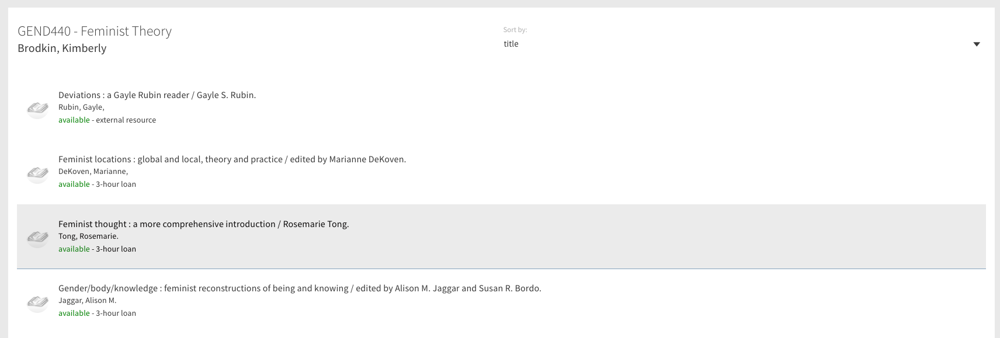

# primo-explore-course-reserves

<!--  -->

## Features
Two new routes are added to the primo-explore application at `/primo-explore/courses` and `/primo-explore/reserves`. The module can be configured with groups of course lists (e.g. for multiple library campuses) that pull currently active courses from Alma using a filter function. Links to a group of course lists can be realized by URLs of the form `/primo-explore/courses/:group` where `group` is an arbitrary identifier.

Course pages display a list of reserve materials with links to view the item in Primo and an indicator of the item's availability. Deep links to an individual course can be realized by URLs of the form `/primo-explore/reserves/:cid?group=some_group` where `cid` is the course id in Alma and `group` is the arbitrary identifier above.

Course and reserve pages can be configured to display information about reserve policies specific to each group. The policy information appears at the top of the screen and can include a set of links to more information.

Both course lists and reserve lists are sortable. Course lists can be filtered by the course academic department code.

This package requires some prior configuration of server-side scripts to interact with the Alma API. Example PHP implementations are provided in the `php` folder.

### Screenshots


---



---


## Install
1. Make sure you've installed and configured [primo-explore-devenv](https://github.com/ExLibrisGroup/primo-explore-devenv).
2. Navigate to your template/central package root directory. For example:
    ```
    cd primo-explore/custom/MY_VIEW_ID
    ```
3. If you do not already have a `package.json` file in this directory, create one:
    ```
    npm init -y
    ```
4. Install this package:
    ```
    npm install primo-explore-course-reserves --save-dev
    ```
---

**IMPORTANT**

This package requires server-side scripts to interact with the Alma API and retrieve courses and bib records. Example PHP implementations can be found in the `php/` folder. These must be hosted in a location that allows cross-domain access via CORS so that they can be called from Primo.

---

## Usage
Once this package is installed, add `courseReserves` as a dependency for your custom module definition.

```js
var app = angular.module('viewCustom', ['courseReserves'])
```
Note: If you're using the `--browserify` build option, you will need to first import the module with:

```javascript
import 'primo-explore-course-reserves';
```

This module requires substantial configuration.

#### Course lists

The `courseLists` constant holds an array of course list objects. The "filter" property of the object will be passed to the server-side to query the Alma API, as [described here](https://developers.exlibrisgroup.com/alma/apis/courses/GET/gwPcGly021pX8N42Hi9+i8Te26R66L4t/25ede018-da5d-4780-8fda-a8e5d103faba). All properties except `sortType` are required and all are strings.

| name       | usage                                                                                                                                    |
|------------|------------------------------------------------------------------------------------------------------------------------------------------|
| `group`    | arbitrary identifier used to link to the lists. /primo-explore/courses/`group` will be the URL to access all lists with this identifier. |
| `title`    | a title for the course list.                                                                                                             |
| `filter`   | filter used to send to server-side code to query alma API for courses. see link above for more info.                                     |
| `sortType` | optional, one of "name" or "code". if present, will pre-sort course lists by selected sort type.                                         |

#### Policy info

The `policyInfo` constant holds an array of policy information objects. These objects are used to generate the group policy information that can appear above course and reserve lists. All properties are optional strings except `links`, which is an array of link objects.

| name    | usage                                                                                                                                                                   |
|---------|-------------------------------------------------------------------------------------------------------------------------------------------------------------------------|
| `group` | the corresponding group for this policy. the policy will display when lists & courses belonging to this group are displayed.                                            |
| `title` | the title of the reserve policy.                                                                                                                                        |
| `body`  | a description of the reserve policy.                                                                                                                                    |
| `links` | an array of objects that will become buttons at the bottom of the policy display. `name` will be the name of the button, and `url` will be the link the button goes to. |

#### URLs

The `URLs` constant holds an object whose properties are links to web services used to retrieve course and bibliographic information. The values of `course`, `courses`, and `bibs` should all point to server-side scripts similar to those in the `php` folder. All properties are required strings.

| name       | usage                                                                                                         |
|------------|---------------------------------------------------------------------------------------------------------------|
| `courses`  | server-side script to retrieve courses from Alma using a filter. see `php` folder for example implementation. |
| `course`   | server-side script to retrieve course from Alma using its ID. see `php` folder for example implementation.    |
| `bibs`     | server-side script to retrieve bib record from Alma using MMSID. see `php` folder for example implementation. |
| `covers`   | an API to fetch book covers by ISBN. the provided example is free.                                            |
| `fallback` | URL to an Alma instance to fetch a placeholder image if no ISBN is available.                                 |

#### Loan Codes

The `loanCodes` constant is an object that maps values from Alma (fulfillment configuration > fulfillment units > fulfillment unit locations tab) to user-readable strings associated with an item's loan type. For example, a fulfillment unit with code `wrs24h` might stand for "24-hour reserves". This information is extracted from the `AVA` field of an item's MARC record. All properties are strings.

### Example

The example below is for a library with view code MYLIB. It adds two course lists to the "law" group, and one to the "main" group. The lists would be accessible at `/primo-explore/courses/main?vid=MYLIB` and `/primo-explore/courses/law?vid=MYLIB`.

We assume that MYLIB has hosted PHP code similar to that provided in the `php/` folder on their server at `my.libary.edu` and enabled CORS.

```js

app.constant('courseLists', [
    {
      group: "main",
      title: "Main Campus Course Reserves",
      filter: "searchableid~main"
    },
    {
      group: "law",
      title: "Law Library 1L Reserves",
      filter: "searchableid~law1",
      sortType: "name"
    },
    {
      group: "law",
      title: "Law Library 2L Reserves",
      filter: "searchableid~law2",
      sortType: "name"
    }
])

app.constant('policyInfo', [
  {
    group: 'main',
    title: 'Main Library Reserve Policy',
    body: `example reserve policy`,
    links: [{
      name: 'For Instructors',
      url: 'http://my.library.edu/course-reserves/instructors'
    },{
      name: 'Fair Use',
      url: 'http://my.library.edu/course-reserves/fairuse'
    }]
  },
  {
    group: 'law',
    title: 'Law Library Reserve Policy',
    body: `example reserve policy`,
    links: [{
      name: 'More Info',
      url: 'http://law.library.edu/course-reserves'
    }]
  }
])

app.constant('URLs', {
  courses: 'https://my.library.edu/getCourses.php?filter=',
  course: 'https://my.library.edu/getCourse.php?cid=',
  bibs: 'https://my.library.edu/getBib.php?mmsid=',
  covers: 'https://syndetics.com/index.aspx?isbn=',
  fallback: 'https://na01.alma.exlibrisgroup.com/view/delivery/thumbnail/01ALLIANCE_MYLIB/'
})

app.constant('loanCodes', {
  'loan3': '3-hour loan',
  'loan24': '24-hour loan',
  'loan72': '3-day loan',
  'law': 'law reserves'
})
```

<!-- ## Running tests
1. Clone the repo
2. Run `npm install`
3. Run `npm test` -->
